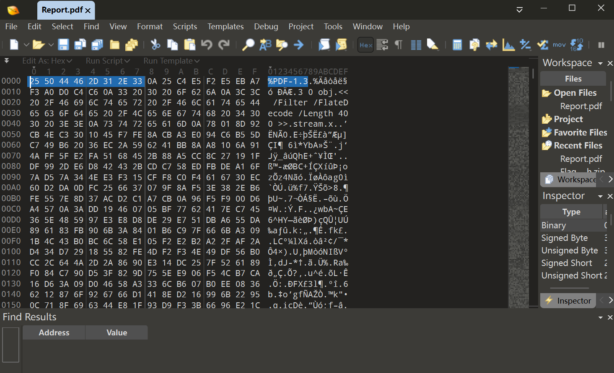
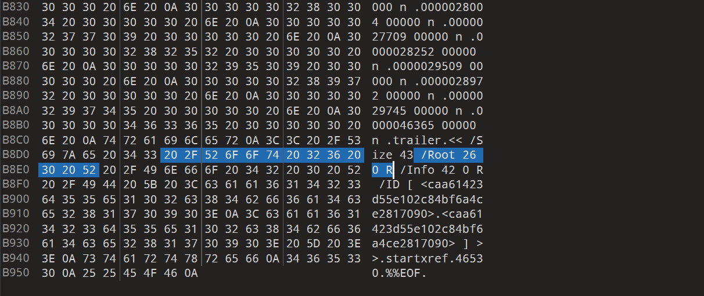
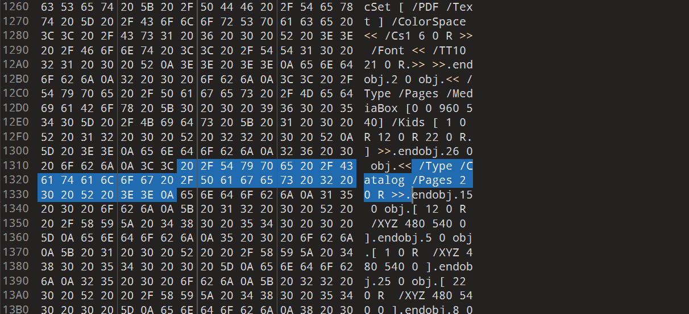
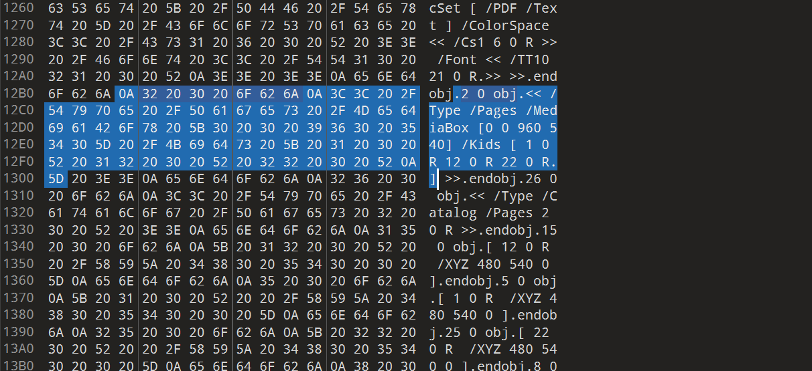
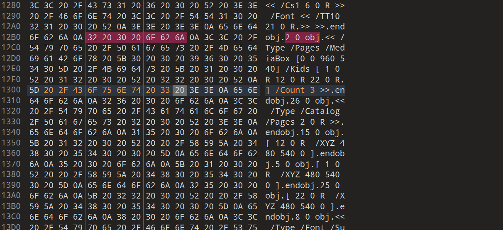
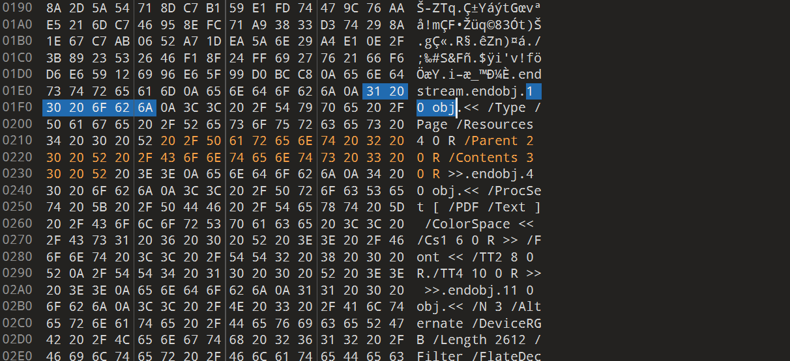
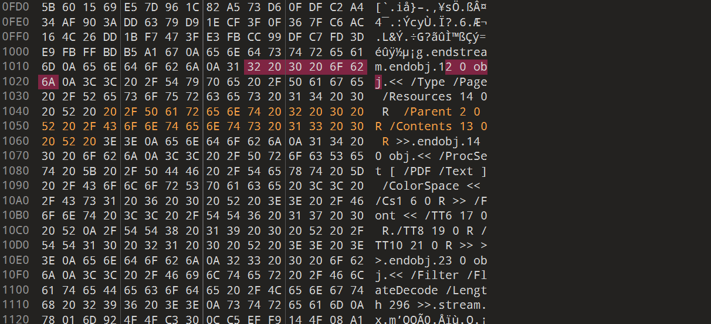
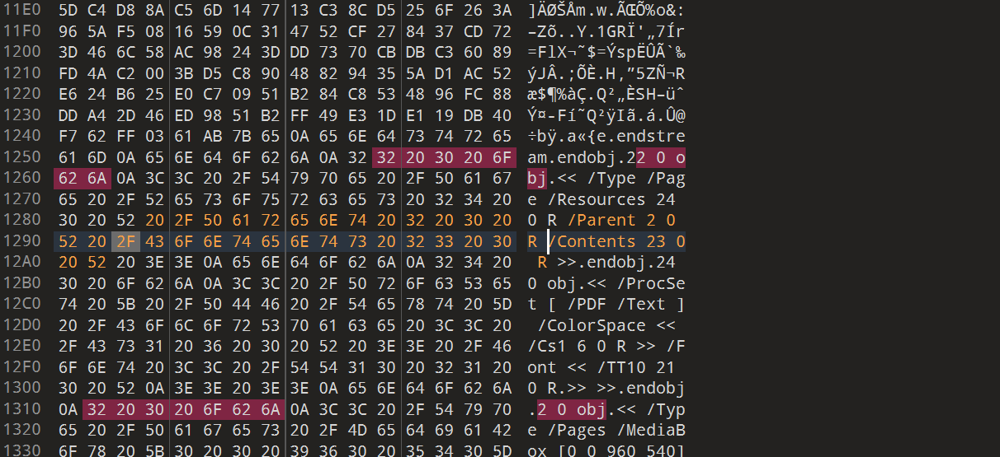
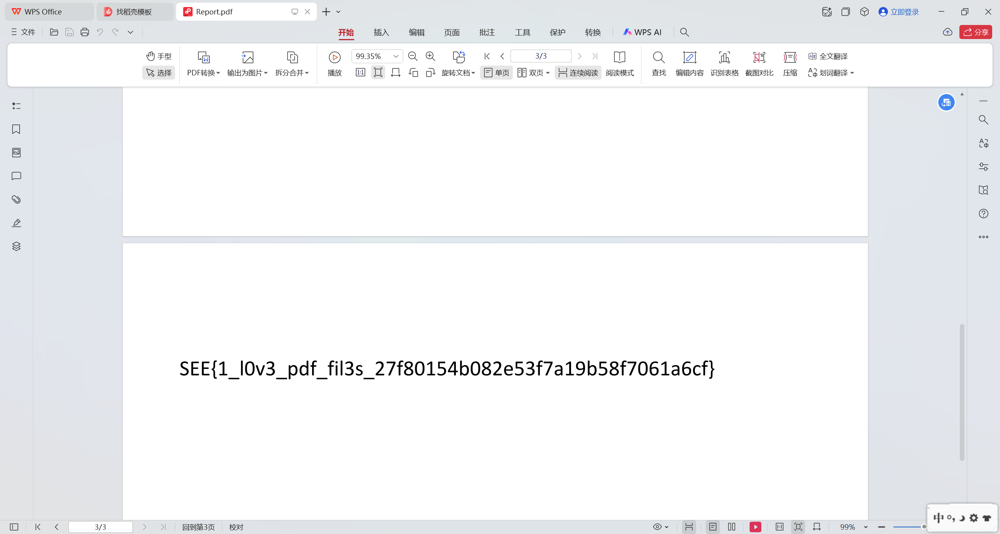
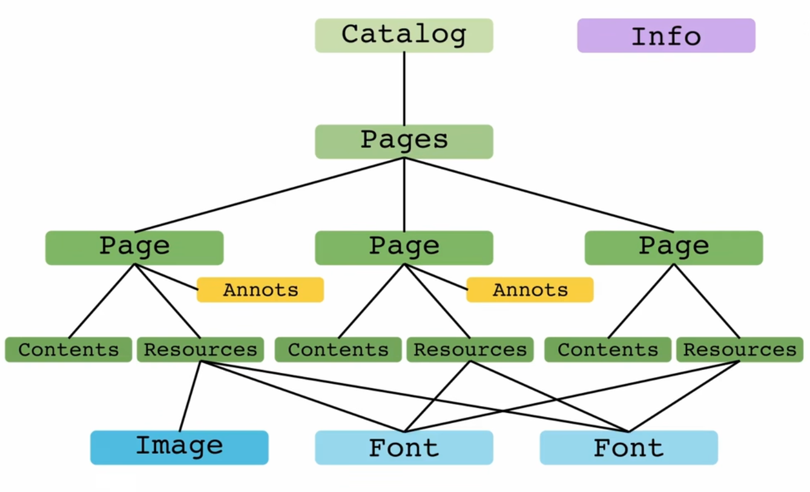

# 题目：[SEETF 2022]Stupid students

## 考点：

#文件结构 #PDF隐写

- 题目信息([link](https://www.nssctf.cn/problem/4241)):

  >Fix the PDF to get the flag

## 思路：

下载后得到一个附件Report.pdf，打开发现是三个空白页，猜测是文件内容没有成功渲染，需要修复。

- 使用 010Editor 打开 Report.pdf，确认文件头为：%PDF-1.3文件类型正确，那就是内部结构可能存在损坏。

  

- 在 HexEditor 中搜索 /Root，发现 trailer 中 /Root 指向 26 0 obj，说明 26 0 obj 为文档的 Catalog 根节点。

  

- 在 26 0 obj 中发现 /Pages 指向 2 0 obj，因此 2 0 obj 为页面树根节点（/Type /Pages）。

  

- 继续查看 2 0 obj，其 /Kids 为：/Kids [ 1 0 R 12 0 R 22 0 R ]，说明该 PDF 包含 3 个页面对象：
  1 0 obj，12 0 obj，22 0 obj（**R** 是引用（Reference），检索需要替换成真正的数据结构 **obj**）

  

- 根据 PDF 规范，/Type /Pages 节点必须包含 /Count 字段，表示其子页面节点的数量。

  当前 /Kids 中包含 3 个页面对象，但缺少 /Count，因此在 2 0 obj 中补充：/Count 3

  

- 接下来依次检查 3 个页面对象：1 0 obj，12 0 obj，22 0 obj。

  根据 PDF 规范，每个 /Type /Page 对象必须包含：
  - /Parent：指向所属的 /Pages 节点
  - /Contents：指向页面对应的内容流对象

  但原始页面对象中缺少上述字段，需要手动补充。Parent已知，需要获取Contents

  经观察发现:

  - 1 0 obj结束是/Type /Page /Resources 4 0 R
  - 12 0 obj结束是/Type /Page /Resources 14 0 R
  - 22 0 obj结束是/Type /Page /Resources 24 0 R

  猜测 3 0 R 、 13 0 R 、 23 0 R是未引用的stream，也就是这三个页面对象引用的流，逐一检索发现正好对应每个页面，且是距离每个页面对象最近的stream，依次补充即可：

  1 0 obj

  

  12 0 obj

  

  22 0 obj

  

- 依次补充完以后打开PDF，得到flag

  

- flag：NSSCTF{1_l0v3_pdf_fil3s_27f80154b082e53f7a19b58f7061a6cf}

## 参考链接

[PDF-Explained](images/https://zxyle.github.io/PDF-Explained/)

## 笔记

### PDF本质：

由数值（整数、浮点数）；布尔值（true/false）；字符串；数组（列表）；字典（哈希表）等常见的数据形式组装起来的一个数据包。以上的种种数据格式，在PDF里面称为**object（对象）**，其中**stream**是PDF里面一种特殊的对象格式，可以储存任意的二进制数据，通常是嵌入PDF的字体、图片等非文本内容

#### 树状结构

PDF中的对象互相关联，组成一个树状结构，其根部是一个名为**Catalog**的对象，然后是**Info**，记录标题、作者、时间等信息以及两种可选对象**Outlines**（梗概、书签）和**PageLabels**（自定义页码），再向前就是**Pages**，Pages下每一个页面对应一个**Page**对象。

每个Page对象记录了一些基本信息（页面尺寸a4.etc），页面的具体信息记录在**Contents**和**Resources**对象中。Resources引用了排版每一页需要的各种资源（图片、字体）。每一页的注释封装在**Annots**中，与Page进行关联，所有Annots对象会被追加到PDF末尾形成一个新的PDF，所以给PDF做完注释以后阅读器会要求‘另存为’。

 

PDF 规范里：

`/Type /Pages`（中间节点）

- `/Kids`子Page列表
- `/Count`页数，该节点下所有叶子节点的总数

`/Type /Page`（叶子节点）

每一个 Page，必须至少有：

```
/Type /Page
/Parent xx 0 R
/Contents yy 0 R
```

阅读器检索顺序：`Catalog`-> `Pages` ->  `Kids` -> `Page`

- 如果 Page 没有 `/Parent`，Page Tree 不闭合，阅读器不知道这个Page属于哪一页文档

- `/Contents`指向内容流stream（文本、图像、路径），没有Contents,Page存在，但是无法渲染。

## 推荐工具

- pdfinfo:PDF语义解析工具

  ```bash
  sudo apt install poppler-utils
  
  pdfinfo XXX.pdf
  ```

- qpdf:PDF结构校验与修复工具

  ```bash
  sudo apt install qpdf
  
  qpdf --check XXX.pdf
  ```

- mutool:解析处理PDF

  mutool可将stream中的二进制数据转写成十六进制（文本形式的PDF流数据），PDF阅读器再转回原本的二进制数据来使用。

  ```bash
  sudo apt install mupdf mupdf-tools
  // 查看文件结构
  mutool show XXX.pdf trailer
  mutool show XXX.pdf xref
  mutool show XXX.pdf 5
  // 重写文件
  mutool clean broken.pdf fixed.pdf
  // 批量渲染
  mutool draw -o output.png input.pdf
  ```

- [PyMuPDF (Python)](https://zhuanlan.zhihu.com/p/24216864067)

  一个高性能的Python库，用于PDF（和其他）文档的数据提取、分析、转换和操作。

- 010 Editor

  直接编辑 PDF 二进制,修补 `/Pages`、`/Kids`等


