# **[羊城杯 2022]躲猫猫**

## 题目：**[羊城杯 2022]躲猫猫**

### 考点

#流量分析 #TLS解密 #Maxicode

### 思路

- 打开流量包查看一下协议分级

  

- 用binwalk扫描转换成二进制文件的task.pcapng

  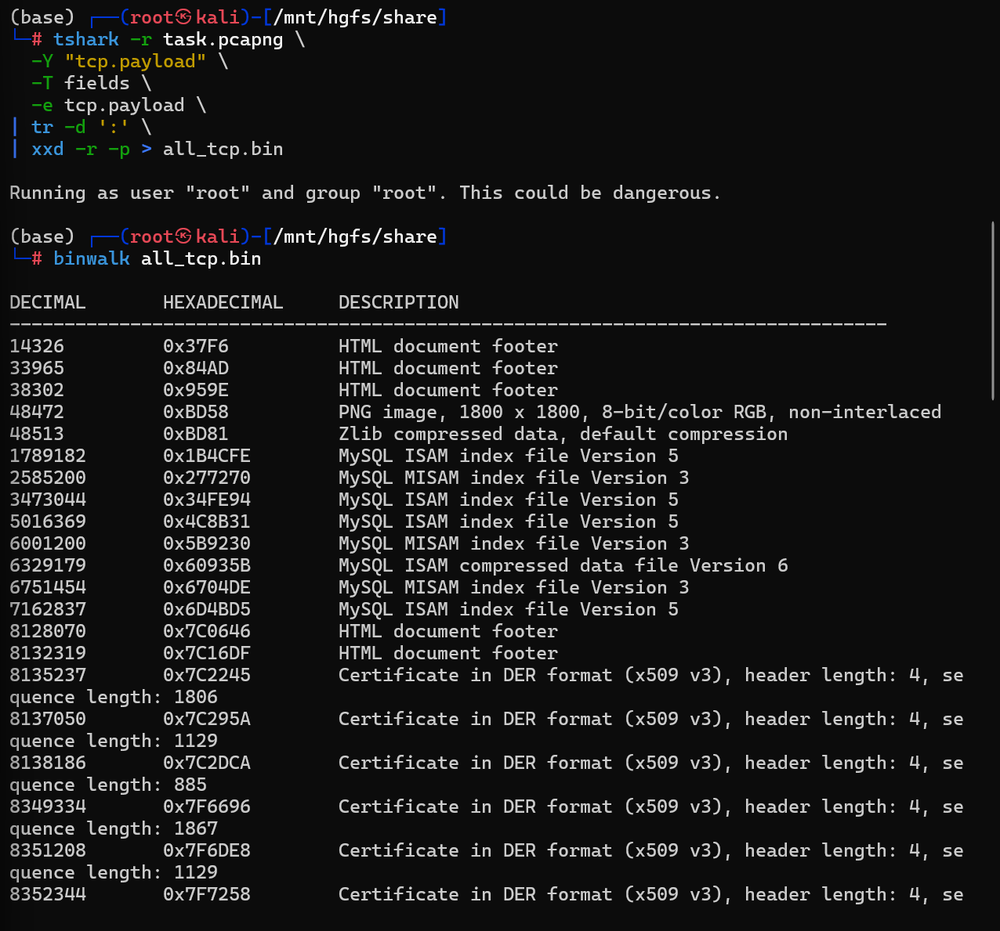

- 发现压缩包，`hide&seek.py`（加密）；`key.log`（未加密）；`secret`（加密）

- zip的起始位置是`8467241 0x813329`, 结束位置是`8473973 (0x814D75)`，zip的总长度是`8473973 - 8467241 + 22 = 6754`

  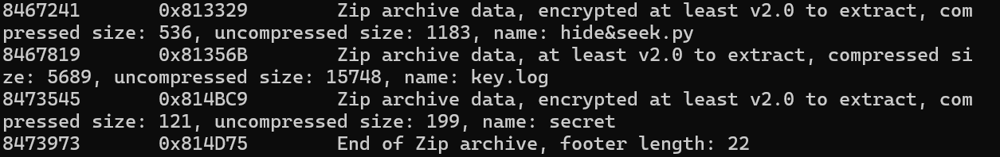

- 把zip切出来，再验证是否切对了(

  ```bash
  dd if=all_tcp.bin of=payload.zip bs=1 skip=8467241 count=6754 status=progress
  
  file payload.zip
  zipinfo payload.zip | head
  ```

  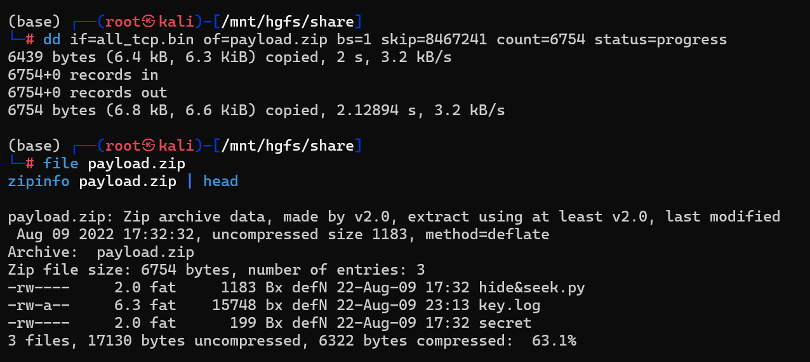

- 确实切对了(，下一步查看key.log找解压密码，用file查看发现不认识，问gpt说是TLS/SSL Key Log，用Wireshark解密TLS

  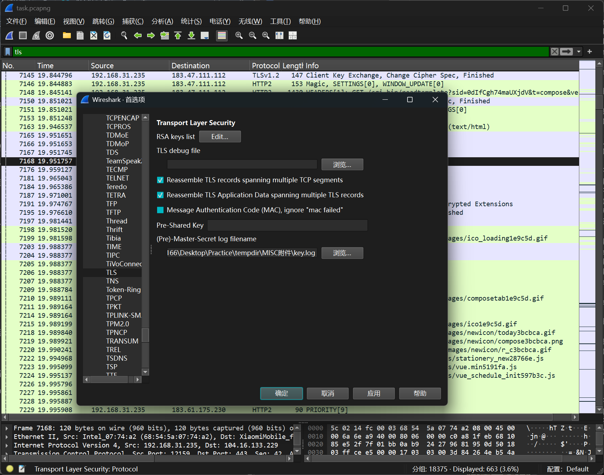

- 过滤发现大量的tls会话，和http请求，发现PNG，用binwalk提取出一张乱码图

  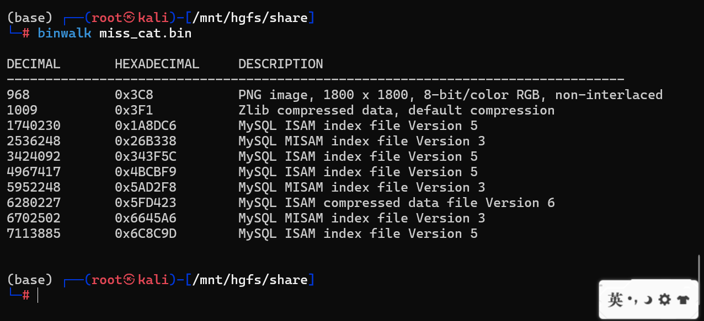

  

- 继续观察http的可疑post，追踪http流发现结尾是ff d9，是JPG格式的结尾

  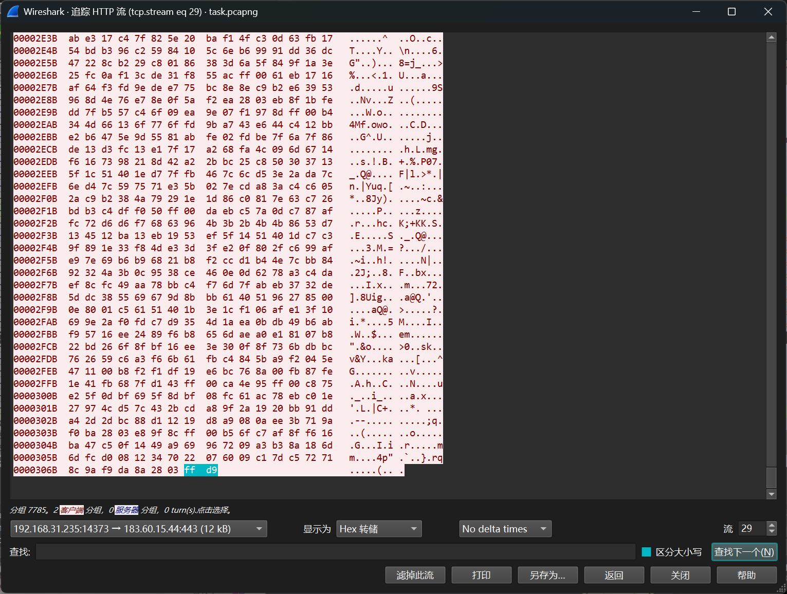

- 导出stream29，用binwalk扫描，切出图片，内容是压缩包密码

  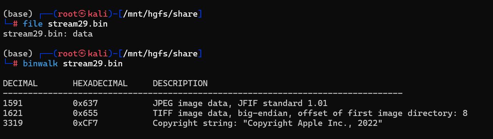

  

  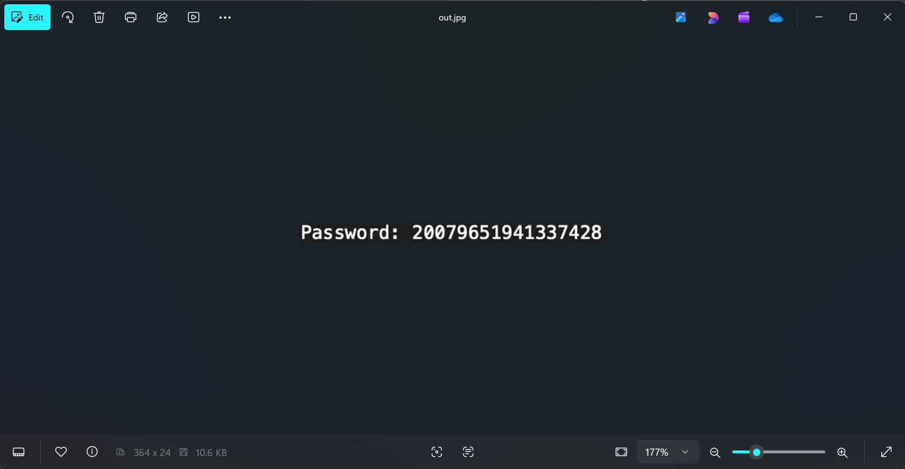

- 解压得到加密脚本和参数，据此让大模型写出解密脚本

  ```python
  #!/usr/bin/env python3
  # -*- coding: utf-8 -*-
  
  import numpy as np
  from PIL import Image
  
  
  def load_xy(secret_path: str):
      with open(secret_path, "r", encoding="utf-8", errors="ignore") as f:
          lines = [line.strip() for line in f.readlines() if line.strip()]
      if len(lines) < 2:
          raise ValueError("secret 文件内容不足两行，无法读取 x, y")
      x = int(lines[0])
      y = int(lines[1])
      return x, y
  
  
  def decrypt_image(enc_path: str, secret_path: str, out_path: str):
      # 读取 x,y
      x, y = load_xy(secret_path)
  
      # 复现 hide&seek.py 的参数生成（与原脚本一致）
      # 注意：round(...,16) 会返回 float
      x1 = round((x / y) * 0.001, 16)
      u1 = (y * 3650) / x
  
      x2 = round((x / y) * 0.00101, 16)
      u2 = (y * 3675) / x
  
      x3 = round((x / y) * 0.00102, 16)
      u3 = (y * 3680) / x
  
      # 读入加密图像（RGB 三通道）
      img = Image.open(enc_path).convert("RGB")
      c = np.array(img, dtype=np.uint8)  # C: ciphertext
      h, w, _ = c.shape
  
      # 解密输出
      p = np.zeros_like(c, dtype=np.uint8)
  
      # 逐像素复现 logistic 序列并解密
      for i in range(h):
          for j in range(w):
              # 与原脚本一致的迭代顺序
              x1 = u1 * x1 * (1 - x1)
              x2 = u2 * x2 * (1 - x2)
              x3 = u3 * x3 * (1 - x3)
  
              r1 = int(x1 * 255)
              r2 = int(x2 * 255)
              r3 = int(x3 * 255)
  
              k = (r1 + r2) ^ r3  # K
  
              # P = (C - K) mod 256
              # 用 int 计算避免 uint8 下溢问题
              for t in range(3):
                  p[i, j, t] = (int(c[i, j, t]) - k) % 256
  
      Image.fromarray(p).save(out_path)
      print(f"[+] Decrypted image saved to: {out_path}")
  
  
  if __name__ == "__main__":
      decrypt_image(
          enc_path="missing_cat.png",  # 你的加密图
          secret_path="secret",  # 你解压得到的参数文件（两行数字）
          out_path="cat_decrypted.png",
      )
  
  ```

- 得到一个神秘图片，比较像QR，可能需要扫描之类的，经搜索发现是Maxicode，但要把中间的猫盖住

  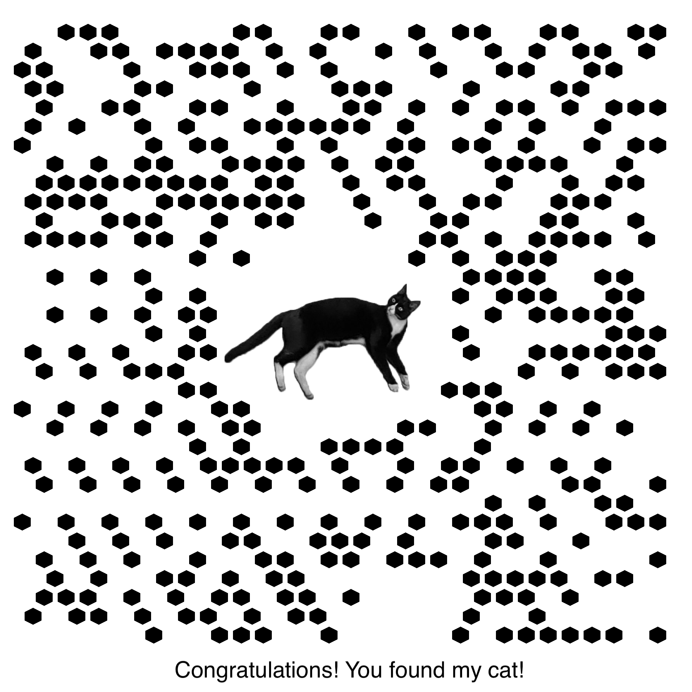

- ps一下，用解密网站扫描得到flag

  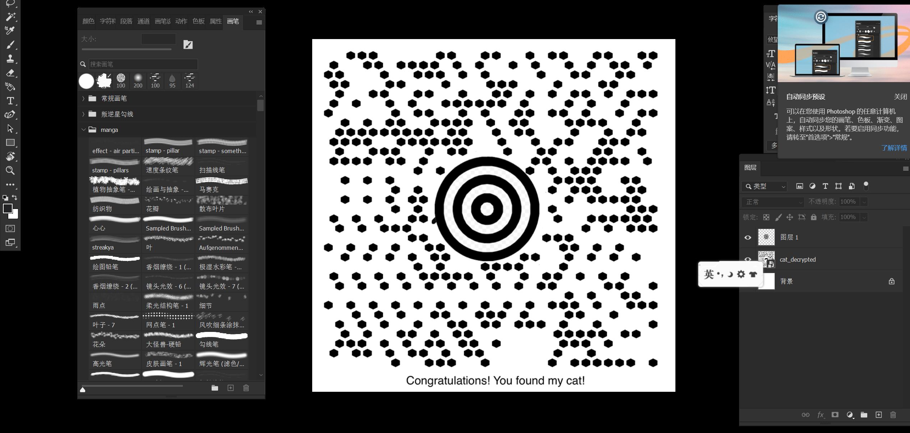

- 解密网站：[Maxicode](https://products.aspose.app/barcode/zh-hans/recognize/maxicode#)

  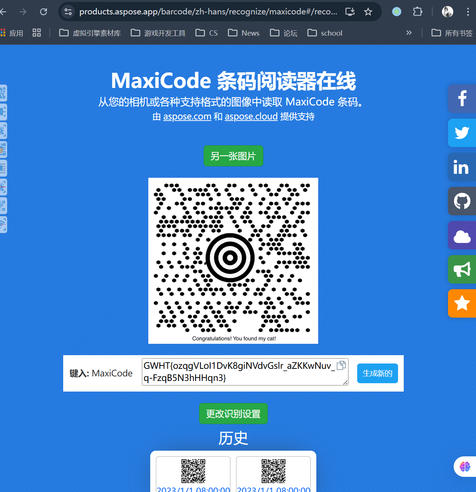


- flag：NSSCTF{ozqgVLol1DvK8giNVdvGslr_aZKKwNuv_q-FzqB5N3hHHqn3}
