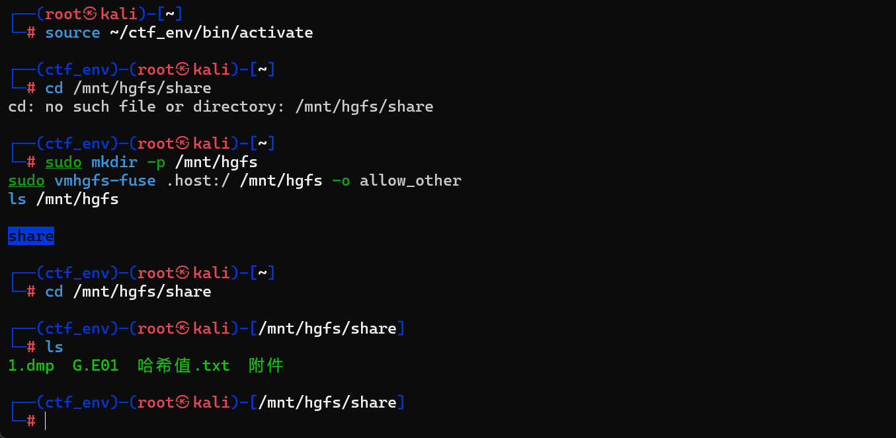
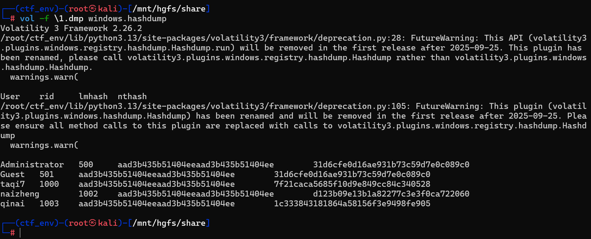
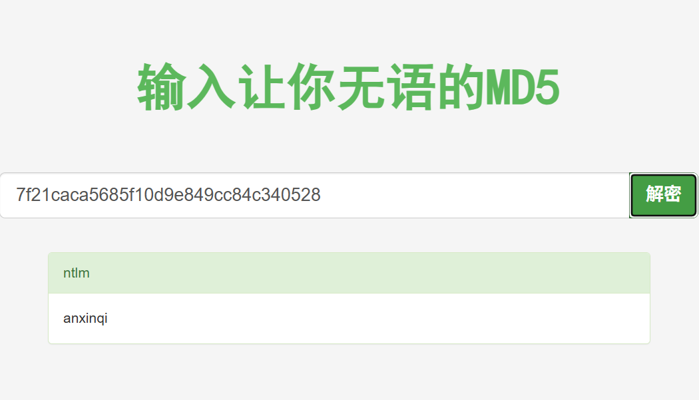

# [蓝帽杯 2022 初赛]计算机取证_1

## 考点：

#内存取证

- 题目信息([link](https://www.nssctf.cn/problem/2445))：

  >现对一个windows计算机进行取证，请您对以下问题进行分析解答。
  >从内存镜像中获得taqi7的开机密码是多少？
  >压缩包密码为93ce7ea39bdd7baa137f1e9b963b7ee5

## 思路：

- 解压附件得到以下文件

  

- 看到 1.dmp,是 Windows 内存转储，使用内存取证标准工具Volatility

- hashdump指令

  ```bash
   vol -f \1.dmp windows.hashdump
  ```

  

- 得到用户taqi7的NTLM哈希 `7f21caca5685f10d9e849cc84c340528`

- MD5解密得到flag

  

- flag：NSSCTF{anxinqi}

## 笔记

- dmp是什么？

  >DMP文件是Dump（转储）的缩写，它是由Windows操作系统生成的一种文件。其主要作用是在系统发生崩溃或蓝屏时，保存系统的内存镜像和其他相关信息，以便开发者能够通过分析这些信息来定位问题。DMP文件通常包含了大量的二进制数据，因此无法直接用常见的文本编辑器打开。


- 本题目的题目标签也提到了一个好用的插件[mimikatz](https://github.com/ParrotSec/mimikatz)，用于从Windows内存中提取登录凭证，能够更快速地解决问题。
